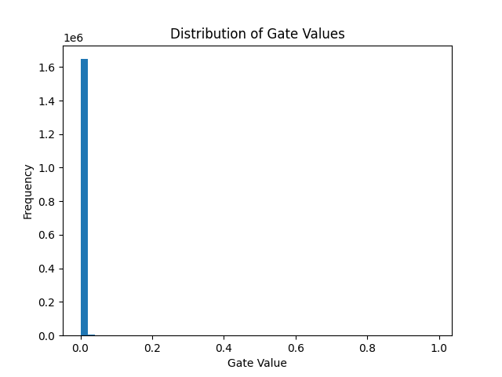

# Self-Pruning Neural Network
This project implements a **self-pruning neural network** using PyTorch.  
The model learns to remove unimportant connections during training using learnable gates and L1 regularization.

##  Overview
Traditional pruning is applied after training.  
In this project, pruning is integrated into the training process itself.

- Each weight is associated with a **gate parameter**
- Gates are constrained between 0 and 1 using a sigmoid function
- Effective weight:
  weight × gate

- If a gate approaches 0 → the connection is effectively removed

##  Key Idea
The model uses a modified loss function:

Total Loss = Classification Loss + λ × Sparsity Loss

- Classification Loss → CrossEntropy
- Sparsity Loss → Mean of gate values

This encourages the network to keep only important connections.

## Results

| Lambda | Accuracy (%) | Sparsity (%) |
|--------|------------|-------------|
| 0.001  | 37.90     | 0.09        |
| 0.01   | 37.21     | 6.95        |
| 0.1    | 41.51     | 82.92       |

## 📈 Gate Distribution

The histogram shows how the model prunes weights:

- Large spike near 0 → pruned connections  
- Remaining values → important weights  

## 🛠️ Tech Stack

- Python  
- PyTorch  
- Torchvision  
- Matplotlib  

## How to Run

pip install -r requirements.txt
python self_pruning_nn.py
